<div align="center">

# ProjectFlow

**A real-time, multi-tenant project management platform inspired by Jira, Linear & Trello**

Bringing Trello's visual simplicity, Jira's sprint planning, and Linear's modern UX into one platform — Kanban boards, sprint planning with burndown charts, backlogs, comments, activity timelines, and live collaboration.

</div>

<p align="center">
  <a href="docs/screenshots/03-dashboard.png">
    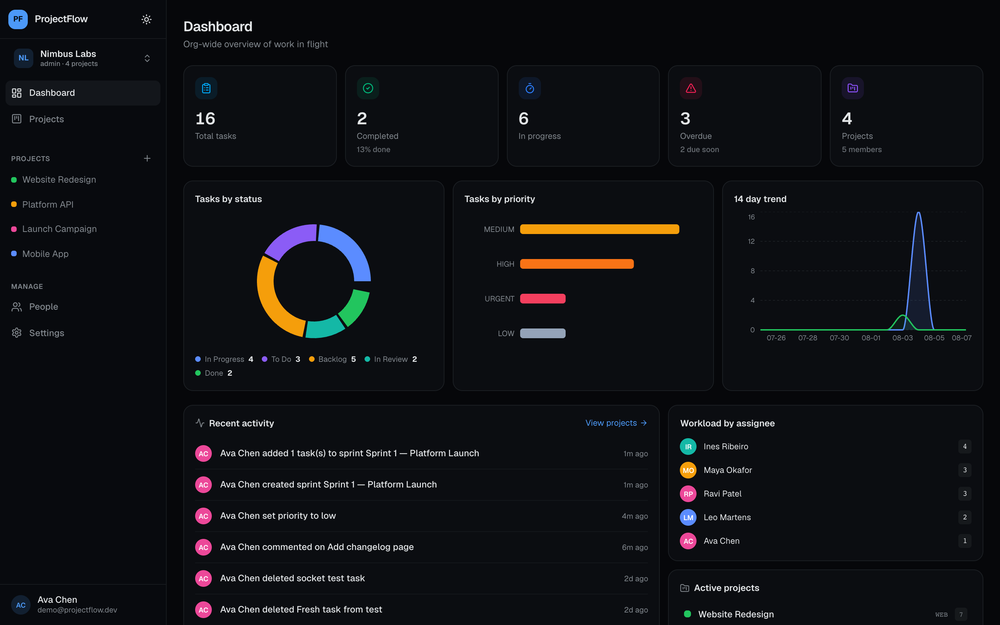
  </a>
  <br/>
  <sub><i>Organization dashboard — analytics, activity feed &amp; workload</i></sub>
</p>

---

## ✨ Highlights

| | |
| --- | --- |
| **Kanban board** | Drag-and-drop tasks (dnd-kit), custom columns, WIP limits, labels & priorities |
| **Sprint planning** | Create/start/complete sprints, move backlog tasks in, real burndown charts |
| **Backlog** | Unscheduled work, quick task creation, bulk assignment to sprints |
| **Task sheet** | Full task details in a slide-over: assignee, priority, type, due date, story points, labels |
| **Comments + Activity timeline** | Team discussion and a full audit trail of who changed what, when |
| **Role-based access** | Admin / Manager / Member enforced on the **backend**, not just hidden buttons |
| **Real-time** | Socket.IO board sync + instant query invalidation across the app |
| **Multi-tenant** | Orgs → Workspaces → Projects, with per-org isolation |

---

## 🖼 Screenshots

### Marketing & auth

<a href="docs/screenshots/01-landing.png">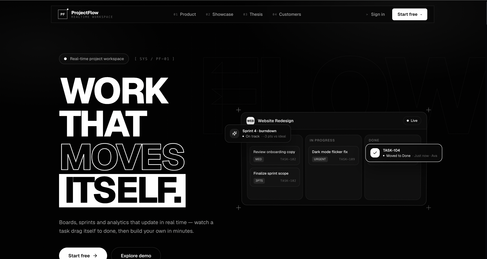</a> &nbsp; &nbsp; <a href="docs/screenshots/02-login.png">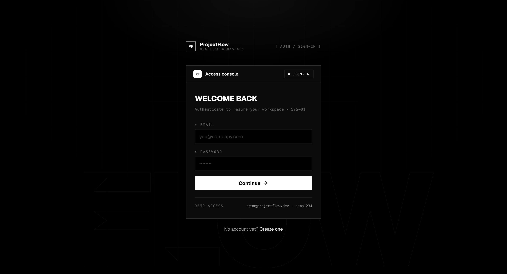</a> &nbsp; &nbsp; <a href="docs/screenshots/02-register.png">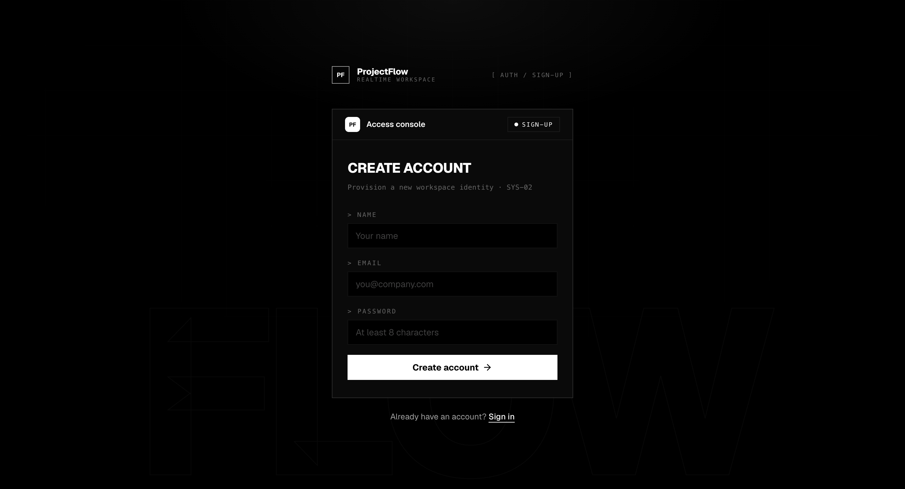</a>

🧑‍💻 **Tip:** the login page shows the demo credentials (`demo@projectflow.dev` / `demo1234`) right on it.

### Workspace

<table>
  <tr>
    <td align="center" width="50%"><a href="docs/screenshots/03-dashboard.png"></a><br/><b>Dashboard</b><br/><sub>Org metrics, status &amp; priority distribution, 14-day trend, workload and recent activity</sub></td>
    <td align="center" width="50%"><a href="docs/screenshots/04-board.png">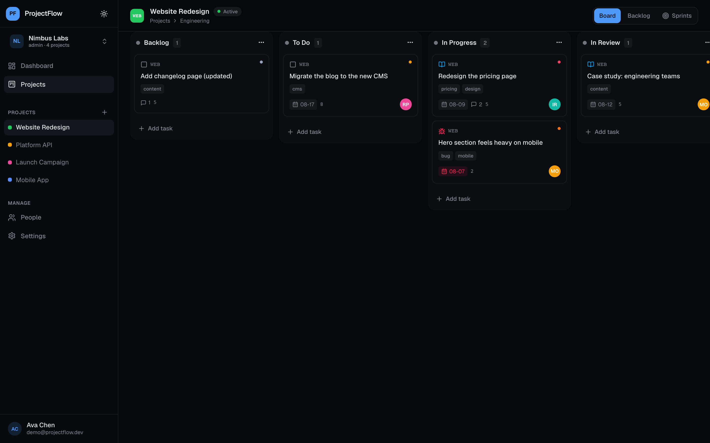</a><br/><b>Kanban board</b><br/><sub>Drag-and-drop tasks across columns, inline creation, WIP, labels &amp; priorities</sub></td>
  </tr>
  <tr>
    <td align="center"><a href="docs/screenshots/05-task-sheet.png">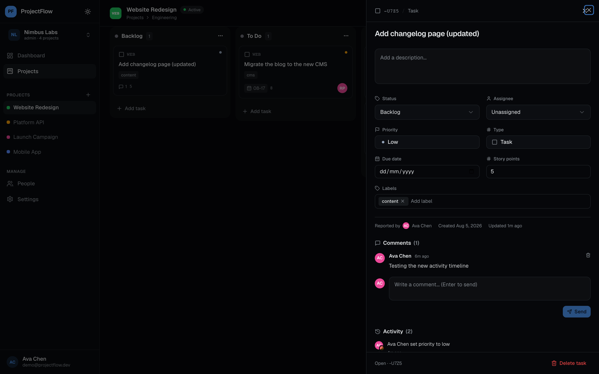</a><br/><b>Task sheet</b><br/><sub>Full task detail slide-over — status, assignee, priority, type, due date, story points, labels</sub></td>
    <td align="center"><a href="docs/screenshots/06-task-sheet-activity.png">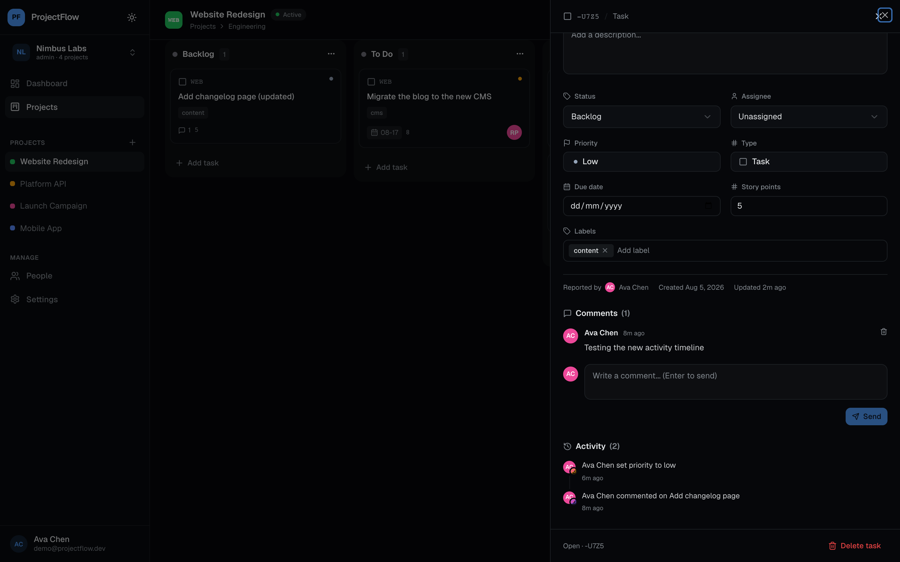</a><br/><b>Activity timeline</b><br/><sub>Audit trail inside every task — who renamed, prioritized, assigned, commented, and when</sub></td>
  </tr>
  <tr>
    <td align="center"><a href="docs/screenshots/07-backlog.png">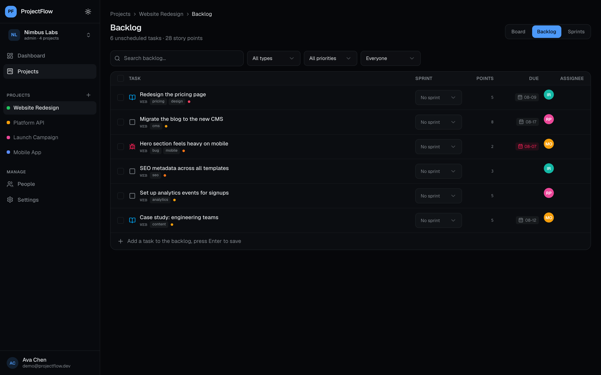</a><br/><b>Backlog</b><br/><sub>Unscheduled work with quick task creation and assignment into planned sprints</sub></td>
    <td align="center"><a href="docs/screenshots/08-sprints.png">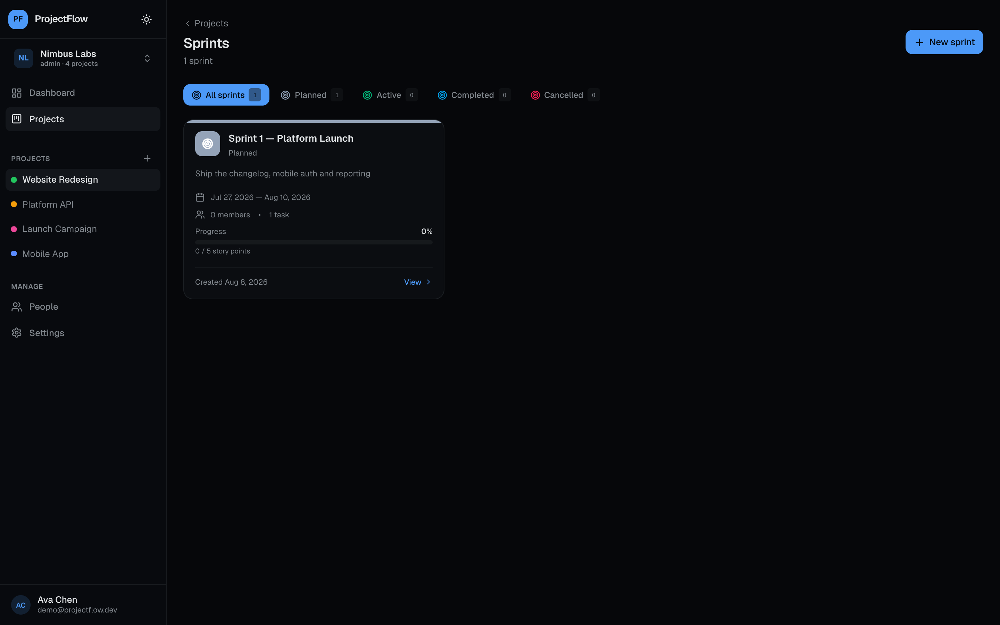</a><br/><b>Sprints</b><br/><sub>Plan development cycles with goals, dates and committed story points</sub></td>
  </tr>
  <tr>
    <td align="center"><a href="docs/screenshots/09-sprint-detail.png">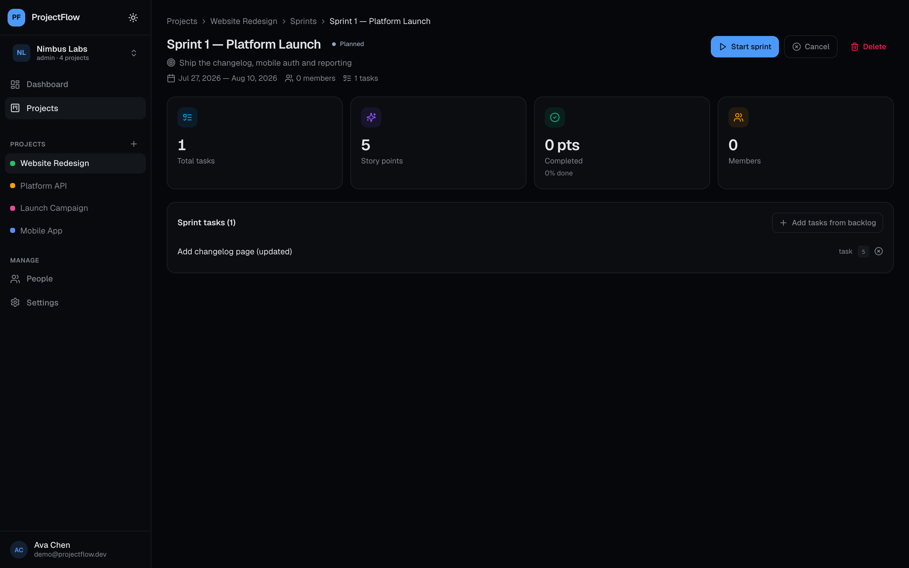</a><br/><b>Sprint detail</b><br/><sub>Progress, team workload and a live burndown chart (ideal vs actual points)</sub></td>
    <td align="center"><a href="docs/screenshots/10-people.png">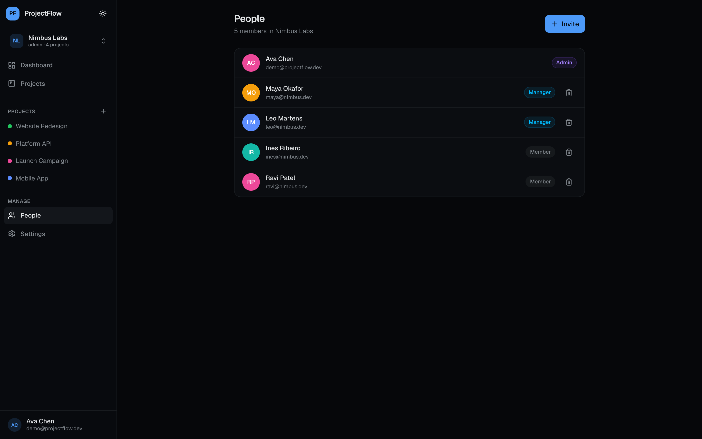</a><br/><b>People</b><br/><sub>Organization members with roles (Admin / Manager / Member) and email invitations</sub></td>
  </tr>
</table>

---

## 🚀 Quick Start

### Prerequisites

- **Node.js** 20+
- **pnpm** (`corepack enable` or `npm i -g pnpm`)

### 1. Install

```bash
git clone <repo-url> ProjectFlow
cd ProjectFlow
pnpm install
```

### 2. Configure the API environment

Create `apps/api/.env`:

```env
DATABASE_URL="file:./dev.db"
PORT=4000
JWT_SECRET="your-access-secret"
JWT_REFRESH_SECRET="your-refresh-secret"
CLIENT_ORIGIN="http://localhost:5173"
```

### 3. Create & seed the database

```bash
pnpm db:push     # creates SQLite schema from prisma/schema.prisma
pnpm db:seed     # demo org "Nimbus Labs" + 5 users + projects/tasks
```

### 4. Run

```bash
pnpm dev
```

- **Web:** http://localhost:5173
- **API:** http://localhost:4000 (`/api/health` to verify)

### 5. Sign in (demo)

| Field | Value |
| --- | --- |
| Email | `demo@projectflow.dev` |
| Password | `demo1234` |

> Other seeded users: `maya@nimbus.dev`, `leo@nimbus.dev`, `ines@nimbus.dev`, `ravi@nimbus.dev` (same password).

### Build for production

```bash
pnpm build        # typechecks + builds API and web
```

---

## 🧱 Tech Stack

| Layer | Technologies |
| --- | --- |
| **Frontend** | React 19 · TypeScript · React Router 7 · TanStack Query · Zustand · Tailwind CSS 4 · shadcn/ui · DnD Kit · Recharts · Socket.IO client |
| **Backend** | Node.js · Express 5 · TypeScript · Prisma ORM · Zod · JWT (access + refresh) · Socket.IO |
| **Database** | PostgreSQL-compatible Prisma schema, SQLite for local dev (`prisma/schema.prisma`) |

---

## 🗂 Project Structure

```
ProjectFlow/
├── apps/
│   ├── api/
│   │   ├── prisma/schema.prisma     # full data model
│   │   └── src/
│   │       ├── index.ts             # express app + router mounting
│   │       ├── socket.ts            # Socket.IO rooms + project events
│   │       ├── middleware/auth.ts   # JWT + org membership guards
│   │       └── routes/              # orgs, workspaces, projects, tasks,
│   │                                # boards, sprints, comments, dashboards
│   └── web/
│       └── src/
│           ├── components/          # board, sprint, task-sheet, shared UI
│           ├── pages/app/            # dashboard, board, backlog, sprints,
│           │                         # sprint-detail, people, settings
│           ├── lib/api.ts            # fetch client + auto token refresh
│           └── stores/auth-store.ts  # zustand auth state
└── projectdescription.md             # full product spec
```


## ⚠️ Difficulties Faced & How They Were Tackled

### 1. Multi-tenant authorization on every route
Every resource (task, board, sprint) belongs to an org, so **one missing membership check = data leak across tenants**.

**Solution:** A reusable `requireAuth` + `requireOrgMember` middleware chain, plus `assertProjectAccess()` helpers that resolve the project → org and verify the caller's membership before any write. There's no endpoint that trusts the frontend hide-buttons; access is always re-verified server-side.

### 2. Express route mounting collisions
`/api/orgs`, `/api/projects`, and `/api/tasks` each host multiple routers (orgs + workspaces + projects + dashboard on one prefix; projects + sprints on another). An early attempt to reuse `requireOrgMember` on `/api/projects/:projectId/sprints` broke, because the path has no `orgId` parameter.

**Solution:** Each router documents its exact mount contract (e.g. `// mounted at /api/projects — /api/projects/:projectId/sprints`). Sprints resolve org membership by looking up the project first instead of expecting an `orgId` in the URL.

### 3. Keeping the board real-time without edit wars
Multiple users moving tasks, renaming columns, and editing the same task would produce clashing UI state.

**Solution:** Socket.IO rooms (`emitToProject`) broadcast events like `task:updated` / `task:moved` / `comment:added`, and the client **invalidates TanStack Query keys** on those events instead of mutating local state. Combined with the 401 → central token-refresh (a single shared `refreshPromise` guards against concurrent refreshes), every view converges to the same ground truth.

### 4. Activity timeline required discipline from day one
An audit trail only works if *every* mutation writes to it — and it's easy to forget.

**Solution:** A shared `logActivity()` helper plus a **deferred events pattern** in the task patch handler — mutations push `() => logActivity(...)` closures and execute them in one `Promise.all`. This caught one subtle bug during development: the event closures were awaited but never **invoked**, so task edits silently logged nothing before the fix (`await Promise.all(events.map(e => e()))`).

### 5. Backlog vs. sprint data overlap
The backlog and the sprint both list tasks, causing duplicates (a task could appear scheduled and unscheduled).

**Solution:** The add-to-sprint API only returns **unscheduled** tasks; the UI never lists a scheduled task as a candidate again. The backend owns that rule, so the UI can't drift.

### 6. Auth session churn while developing
Tokens expired mid-flow during dev and the UI logged users out abruptly.

**Solution:** A single-flight refresh interceptor in `lib/api.ts` — the first 401 triggers one refresh, all concurrent retries await the same promise, and only a failed refresh logs the user out.

---

## 🏆 Best Implementation Choices

1. **The Task Sheet** — the core of daily use. Inline-editable title, description, status, assignee, priority, type, due date, story points, labels, plus comments and a full activity timeline — all typed, all invalidated through one query-key graph (`task` / `board` / `dashboard` / `activity`).

2. **Sprint burndown** — computed analytically on the server (ideal line vs actual completed points across the sprint window) and rendered with Recharts. No client-side data juggling.

3. **Deferred activity logging** — every mutation describes the events it produces; logging is atomic-ish and easy to extend with new event types. It also powers the dashboard's "Recent activity" feed with zero extra queries.

4. **Real-time, then converge** — Socket.IO for notifications + TanStack Query invalidation for convergence gives you "feels live" without optimistic-update bugs.

5. **Route-mount contracts** — one glance at `index.ts` explains the whole API surface; each router documents where it hangs.

---

## 🧭 Current Status & What's Next

Implemented: auth (JWT + refresh), orgs/workspaces/projects, Kanban with DnD, task sheet, comments, **activity timeline**, sprints + burndown, backlog, dashboard analytics, people/invites, real-time sync.

On the roadmap (per `projectdescription.md`):

- [ ] File attachments (S3/Cloudinary + drag & drop)
- [ ] Notifications center + mention `@user` emails
- [ ] Time tracking & estimates vs. actual reports
- [ ] Global search across orgs/projects/tasks
- [ ] Docker Compose + GitHub Actions CI/CD

---

## 📄 License

Private / internal project. See `projectdescription.md` for the full product spec.

---

<div align="center">
Made with React, Express, Prisma, Socket.IO & Tailwind — and a lot of caffeine ☕
</div>